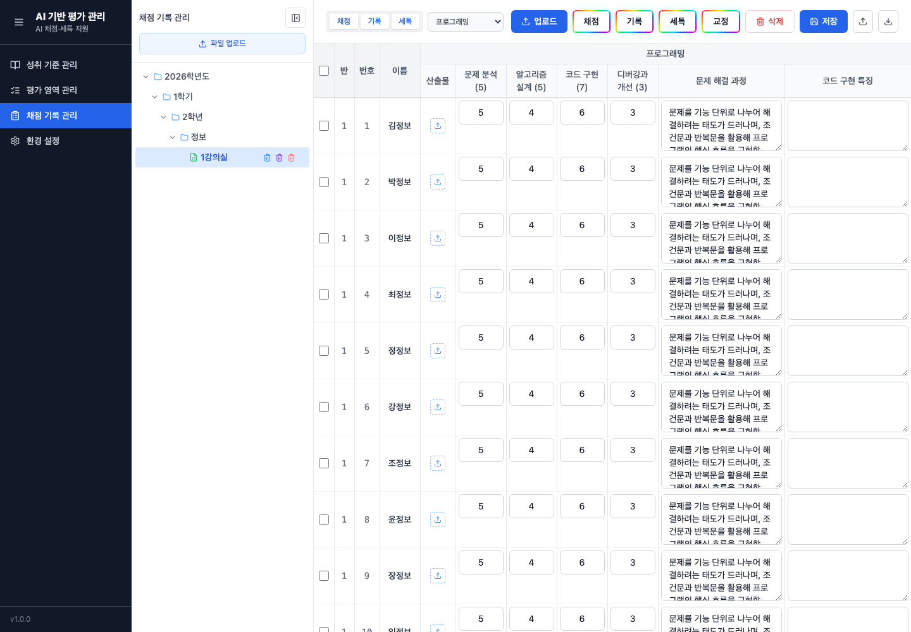

# AI 학생 평가 도우미

학생 평가, 채점, 세특 기록 작성을 보조하는 로컬 웹 애플리케이션입니다. 나이스에서 내려받은 엑셀 파일을 업로드해 성취 기준, 수행평가 영역, 학생별 채점 기록, 세특 초안을 한곳에서 관리할 수 있습니다.

## 처음 사용하는 순서

아래 순서대로 진행하면 GitHub에서 프로젝트를 내려받는 것부터 실행과 기본 사용까지 이어집니다.

## 1. 준비물 설치

먼저 아래 프로그램이 설치되어 있어야 합니다.

- Git
- Node.js 20.19 이상 권장
- npm

터미널에서 설치 여부를 확인합니다.

```bash
git --version
node --version
npm --version
```

명령어가 버전 번호를 출력하면 준비된 상태입니다.

## 2. GitHub에서 프로젝트 클론

작업할 폴더로 이동한 뒤 GitHub 저장소를 클론합니다.

```bash
git clone https://github.com/bloomgloom/ai-student-assessment-helper.git
cd ai-student-assessment-helper
```

이미 ZIP 파일로 내려받았다면 압축을 푼 폴더로 이동하면 됩니다. 다만 이후 업데이트를 받기 쉽도록 `git clone` 사용을 권장합니다.

## 3. 의존성 설치

프로젝트 루트 폴더에서 한 번만 실행합니다.

```bash
npm install
```

이 명령은 `client`와 `server` 워크스페이스의 필요한 패키지를 함께 설치합니다.

## 4. 개발 서버 실행

프로젝트 루트 폴더에서 실행합니다.

```bash
npm run dev
```

실행 후 브라우저에서 아래 주소로 접속합니다.

```text
http://localhost:5173
```

개발 모드에서는 서버 API가 `http://localhost:3001`에서 함께 실행됩니다. `5173` 포트가 이미 사용 중이면 Vite가 다른 포트를 안내할 수 있으니 터미널에 출력된 주소를 사용하세요.

## 5. 첫 사용 워크플로우

앱에 접속한 뒤 왼쪽 메뉴를 위에서 아래 순서로 사용하면 됩니다.

### 5-1. 환경 설정

`환경 설정` 메뉴에서 AI 생성에 사용할 LLM 공급자를 설정합니다.

1. LLM 공급자를 선택합니다.
2. API 키가 필요한 공급자는 API 키를 입력합니다.
3. 로컬 모델이나 커스텀 API를 쓰는 경우 Base URL을 입력합니다.
4. 모델명을 확인하거나 입력합니다.
5. `저장`을 누릅니다.
6. `연결 테스트`로 정상 동작하는지 확인합니다.

공급자를 바꿔도 각 공급자별 API 키, 모델명, Base URL, 최대 동시 요청 수 설정은 따로 기억됩니다. 여러 공급자를 번갈아 사용할 때는 공급자만 바꾼 뒤 저장하거나 연결 테스트를 실행하면 됩니다.

지원되는 공급자 흐름은 아래와 같습니다.

- Google Gemini
- OpenAI
- Anthropic Claude
- Ollama
- OpenAI 호환 API

AI 생성 기능을 쓰지 않고 파일 정리와 기록 편집만 할 경우에도 앱 사용은 가능합니다. 단, AI 생성 버튼을 사용하려면 환경 설정이 필요합니다.

### 5-2. 성취 기준 관리

`성취 기준 관리` 메뉴에서 성취기준/평가기준 파일을 업로드합니다.

나이스에서 아래 경로로 이동해 성취기준 및 성취수준 파일을 엑셀로 저장한 뒤 업로드합니다.

```text
나이스 > 교과담임 > 성적 > 지필/수행선행작업 > 성취기준관리
```

해당 화면에서 성취기준 및 성취수준(평가기준)을 조회 및 출력한 뒤, `파일 저장` 버튼을 눌러 엑셀(XLS)을 선택하세요. 업로드가 끝나면 과목과 영역별 성취 기준이 왼쪽 목록에 표시됩니다.

성취 기준 화면 상단의 `작업 내용 다운로드`를 누르면 선택한 영역의 성취 기준을 작업용 엑셀로 저장할 수 있습니다. `작업 내용 업로드`는 이 엑셀의 `기본정보` 시트에 있는 학년도, 학기, 학년, 과목, 영역 정보를 기준으로 성취 기준을 다시 불러옵니다. 같은 영역의 기존 성취 기준은 업로드한 엑셀 내용으로 교체됩니다.

### 5-3. 평가 영역 관리

`평가 영역 관리` 메뉴에서 영역 관리 엑셀 파일을 업로드합니다.

나이스에서 아래 경로로 이동해 반영비율/만점관리 파일을 엑셀로 저장한 뒤 업로드합니다.

```text
나이스 > 교과담임 > 성적 > 지필/수행선행작업 > 반영비율/만점관리
```

해당 화면에서 조회 및 출력한 뒤, `파일 저장` 버튼을 눌러 엑셀(XLS)을 선택하세요. 앱은 파일에서 과목, 수행평가 영역, 반영 여부, 만점 정보를 읽어옵니다. 이후 각 영역을 선택해 아래 내용을 정리합니다.

- 성취 기준 연결
- 채점 기준 설정
- 기록 기준 설정
- 세특 기준 설정
- AI 기준 자동 생성

평가 영역 관리가 먼저 되어 있어야 채점 기록 관리에서 채점 파일과 학생 기록을 영역별로 다루기 쉽습니다.

### 5-4. 채점 기록 관리

`채점 기록 관리` 메뉴에서 채점 파일과 과목세특 파일을 업로드합니다.

여러 엑셀 파일을 한 번에 선택할 수 있습니다.

- 파일명에 `과목세특`이 포함되면 세특 파일로 처리됩니다.
- 그 외 엑셀 파일은 채점 파일로 처리됩니다.

수행평가 채점 파일은 나이스에서 아래 경로로 이동해 다운로드합니다.

```text
나이스 > 교과담임 > 성적 > 수행평가 > 수행평가성적관리
```

해당 화면에서 조회한 뒤 `일괄파일업로드 > 엑셀다운로드`를 선택하세요.

교과 세특 파일은 나이스에서 아래 경로로 이동해 다운로드합니다.

```text
나이스 > 교과담임 > 성적 > 성적처리 > 과목별세부능력및특기사항
```

해당 화면에서 조회한 뒤 `엑셀내려받기`를 선택하세요.

과목세특 파일은 나이스 파일명 버그로 강의실 번호 자리에 학년이 들어가는 경우가 있습니다. 파일명에서 학년 다음에 나오는 숫자는 강의실 번호로 사용되므로, 실제 강의실 번호와 다르게 학년 숫자로 내려받아졌다면 업로드 전에 해당 숫자를 실제 강의실 번호로 수정하세요. 채점 파일과 과목세특 파일의 학년도, 학기, 학년, 과목, 강의실 정보가 일치해야 같은 강의실 데이터로 합쳐집니다.

업로드 후 반, 과목, 영역을 선택해 학생별 기록을 확인하고 수정합니다. 환경 설정이 완료되어 있으면 AI 생성 기능으로 채점 기록, 영역별 기록, 과목 공통 세특 초안을 만들 수 있습니다.

채점 기록 관리 화면의 주요 동작:

- 상단의 `채점`, `기록`, `세특` 보기 버튼과 영역 선택은 `학년도/학기/학년/과목` 단위로 자동 저장됩니다. 같은 과목의 다른 강의실로 이동해도 이전 보기 상태가 유지되고, 다른 과목은 별도 상태를 사용합니다.
- 강의실을 선택하지 않은 상태에서도 `작업 내용 업로드`를 사용할 수 있습니다. 엑셀의 `기본정보` 시트에 있는 강의실을 찾아 기존 강의실에 반영하거나, 없으면 새 강의실을 만든 뒤 내용을 불러옵니다.
- 강의실을 선택한 상태의 `작업 내용 업로드`는 현재 강의실의 저장된 AI 채점/활동/세특 내용을 업로드한 엑셀 내용으로 덮어씁니다.
- `작업 내용 다운로드`는 현재 강의실의 학생 목록과 저장된 기록 내용을 엑셀로 내보냅니다.
- `채점`, `기록`, `세특`, `교정` 버튼으로 선택 학생 또는 전체 학생을 일괄 처리할 수 있습니다.
- AI가 채점이나 기록을 생성해도 즉시 저장되지 않습니다. 사람이 직접 수정한 것과 동일하게 저장 전 변경 상태로 남고, `저장`을 눌러야 데이터베이스에 반영됩니다.
- 저장되지 않은 칸은 연한 색으로 표시됩니다. 저장이 완료되면 표시가 사라집니다.
- 저장되지 않은 변경이 있는 상태에서 강의실이나 메뉴를 이동하거나 브라우저를 닫으려 하면 확인 메시지가 표시됩니다.
- AI 채점은 각 평가 항목의 점수와 짧은 이유를 함께 받습니다. 이유는 해당 점수 칸에 마우스를 올리면 확인할 수 있습니다.
- AI 처리 중에는 팝업 레이어가 표시됩니다.
- `중단`을 누르면 `중단 중...` 상태로 바뀌고, 실행 중인 AI 요청이 취소되거나 종료된 뒤 팝업이 닫힙니다.
- 표 편집 중 `Tab`은 다음 칸, `Shift+Tab`은 이전 칸으로 이동합니다.
- `Enter`는 아래 칸, `Shift+Enter`는 위 칸으로 이동합니다.
- 방향키는 셀 이동 단축키로 사용하지 않습니다.

### 5-5. 업로드 후 기준 정리

파일을 업로드한 뒤에는 평가 영역 관리에서 각 영역의 기준을 먼저 정리합니다.

- `성취 기준` 탭에서는 영역에 연결할 성취 기준을 확인하고 필요하면 수정합니다.
- `채점` 탭에서는 AI가 점수를 판단할 평가 항목, 배점, 루브릭을 정리합니다.
- `기록` 탭에서는 수행평가 영역별 활동 기록을 만들 때 참고할 항목과 프롬프트를 정리합니다.
- `세특` 탭에서는 과목 공통 세특을 만들 때 사용할 기준과 프롬프트를 정리합니다.

각 탭의 AI 생성 버튼을 사용하면 기준 초안을 만들 수 있습니다. AI가 만든 기준은 바로 최종본으로 확정되는 것이 아니므로, 내용을 확인하고 수정한 뒤 `저장`을 눌러 반영하세요.

성취 기준 관리와 평가 영역 관리는 `작업 내용 다운로드`로 현재 정리한 내용을 엑셀로 보관할 수 있고, 같은 형식의 파일을 `작업 내용 업로드`로 다시 불러올 수 있습니다.

### 5-6. 학생별 채점과 기록 작성

채점 기록 관리에서 강의실을 선택하면 학생 목록과 영역별 칸이 표시됩니다.

1. 상단에서 `채점`, `기록`, `세특` 중 작업할 보기를 선택합니다.
2. 필요한 경우 영역 선택에서 특정 영역만 봅니다.
3. 직접 칸을 수정하거나, 학생별 버튼 또는 전체 버튼으로 AI 생성을 실행합니다.
4. 수정된 칸은 연하게 표시됩니다.
5. 내용을 확인한 뒤 `저장`을 눌러 데이터베이스에 반영합니다.

AI가 생성한 내용도 사람이 직접 수정한 내용과 동일하게 저장 전 변경 상태로 남습니다. 페이지를 벗어나기 전에 저장하지 않으면 확인 메시지가 표시됩니다.

채점 점수 칸에 마우스를 올리면 AI가 점수를 판단한 간단한 이유를 확인할 수 있습니다. 이유는 참고용이므로 실제 반영 전에는 교사가 최종 확인해야 합니다.

### 5-7. 산출물 업로드

학생별 산출물이 있다면 채점 기록 관리 화면에서 학생 또는 영역에 연결해 업로드할 수 있습니다. ZIP 파일을 사용하면 여러 파일을 한 번에 올릴 수 있습니다.

업로드된 산출물은 해당 학생과 영역에서 미리보기로 확인할 수 있습니다. AI 채점이나 기록 생성을 할 때 산출물 내용을 함께 참고하도록 사용할 수 있습니다.

AI가 내용 읽기에 활용할 수 있는 산출물 파일 형식:

- 문서/텍스트: `.hwpx`, `.txt`, `.md`
- 표 데이터: `.csv`
- 노트북: `.ipynb`
- 코드: `.py`, `.js`, `.ts`, `.jsx`, `.tsx`, `.c`, `.cpp`, `.h`, `.java`, `.css`, `.sql`

환경 설정의 `산출물 첫 설명 블록 제외`를 켜면 아래 항목만 AI 입력에서 제외합니다.

| 파일 형식 | 제외하는 내용 |
| --- | --- |
| `.py` | 파일 맨 앞의 `'''...'''` 또는 `"""..."""` |
| `.js`, `.ts`, `.jsx`, `.tsx`, `.c`, `.cpp`, `.h`, `.java`, `.css`, `.sql` | 파일 맨 앞의 `/*...*/` |
| `.hwpx` | 첫 번째 표의 첫 행 |
| `.ipynb` | 첫 번째 셀이 마크다운 셀일 때 해당 셀 |
| 그 외 형식 | 지원 안 함 |

`#`와 `//` 주석, 코드 중간의 블록 주석은 제외하지 않습니다.

화면 미리보기는 위 형식 외에도 `.pdf`를 지원합니다. 다만 PDF는 AI가 본문을 직접 추출해 읽는 형식이 아니므로, AI 채점이나 기록 생성에 내용을 반영하려면 텍스트 파일로 변환해 함께 업로드하는 것을 권장합니다.

### 5-8. 결과 저장과 나이스 반영

작업이 끝나면 채점 기록 관리 화면에서 결과를 엑셀로 내보냅니다.

- 채점 결과는 나이스 수행평가 채점 파일 형식에 맞춰 내보냅니다.
- 세특 결과는 과목세특 파일 형식에 맞춰 내보냅니다.
- `작업 내용 다운로드`는 앱에서 다시 이어서 작업할 수 있는 백업 파일로 사용할 수 있습니다.

내보낸 파일은 내용을 다시 확인한 뒤 나이스에 업로드하거나 붙여넣으세요. 앱에서 생성한 내용은 초안 보조용이며, 최종 입력 전에는 교사의 검토가 필요합니다.

### 5-9. 이어서 작업하기

앱을 다시 실행하면 저장된 데이터베이스를 기준으로 이전 작업을 이어서 볼 수 있습니다. 같은 과목 안에서는 채점 기록 관리의 `채점`, `기록`, `세특` 보기 선택과 영역 선택이 유지됩니다. 다른 과목은 과목별로 별도의 보기 상태를 사용합니다.

다른 컴퓨터로 작업을 옮기거나 백업하려면 앱의 `작업 내용 다운로드`로 만든 엑셀 파일과 `storage/` 폴더의 데이터를 별도로 보관하세요. 개인정보가 포함될 수 있으므로 공유 저장소나 공개 저장소에 올리지 않도록 주의해야 합니다.

## 화면 예시

환경 설정을 제외한 주요 화면입니다. 실제 화면은 업로드한 과목, 영역, 강의실 데이터에 따라 달라질 수 있습니다.

### 성취 기준 관리


### 평가 영역 관리


### 채점 기록 관리



## 데이터 저장 위치

서버 실행 시 필요한 디렉터리는 자동으로 생성됩니다.

- 기본 저장 루트: `storage/`
- 데이터베이스: `storage/data/assessment.db`
- 업로드 파일: `storage/uploads/`
  - 성취 기준 원본: `storage/uploads/criteria/`
  - 평가 영역 원본: `storage/uploads/domain/`
  - 채점 원본: `storage/uploads/scoring/`
  - 기록/세특 원본 및 작업 파일: `storage/uploads/records/`
- LLM 요청/응답 로그: `storage/logs/`

앱의 `환경 설정` 화면에서 데이터 저장 경로를 바꿀 수 있습니다. `APP_STORAGE_DIR` 환경변수를 설정해 실행하면 해당 경로를 우선 사용하며, 이 경우 화면에서는 저장 경로를 변경할 수 없습니다.

앱의 `환경 설정` 화면에서 초기화를 실행하면 주요 데이터와 업로드 파일이 삭제됩니다. LLM 설정은 유지됩니다.

## 개인정보와 배포 주의사항

학생 명단, 개인번호, 업로드 산출물, 생성된 채점/기록 내용은 로컬 저장소에만 저장됩니다. 이 프로젝트는 기본적으로 Git에 포함되면 안 되는 데이터 경로와 파일 형식을 `.gitignore`에 포함합니다.

Git에서 제외되는 주요 항목:

- `storage/`
- `storage.config.json`
- `.log/`
- `*.env`, `.env.local`
- `*.db`, `*.sqlite`, `*.sqlite3`
- `template/`
- `server/data/`, `server/uploads/` 같은 이전 저장 경로

배포하거나 GitHub에 공개하기 전에는 아래 명령으로 민감 파일이 추적 중인지 확인하는 것을 권장합니다.

```bash
git status --short
git ls-files storage server/data server/uploads template .log '*.db' '*.xlsx' '*.xls' '*.csv' '*.hwpx' '*.zip'
```

두 번째 명령이 아무것도 출력하지 않으면 해당 민감 파일들은 Git 추적 대상이 아닙니다. 실제 운영 데이터가 별도의 `APP_STORAGE_DIR`에 있다면 그 경로는 배포 범위 밖에서 별도로 관리하세요.

## 프로젝트 구조

```text
.
├── client/              # React 프론트엔드
├── server/              # Express API 서버
│   └── src/             # 서버 소스 코드
├── storage/             # 로컬 DB, 업로드, 로그 저장 위치 (Git 제외)
├── package.json         # 루트 workspace 및 실행 스크립트
└── package-lock.json    # npm 의존성 잠금 파일
```

## 기술 구성

- Client: React, TypeScript, Vite, Tailwind CSS
- Server: Express, TypeScript, SQLite, ExcelJS
- Workspace: npm workspaces (`client`, `server`)

## 문제 해결

### `npm install`이 실패하는 경우

Node.js 버전을 확인한 뒤 Node.js 20.19 이상으로 다시 시도하세요.

```bash
node --version
```

### 브라우저 접속이 안 되는 경우

개발 서버가 실행 중인지 확인하고 터미널에 출력된 주소로 접속하세요.

```bash
npm run dev
```

### 포트가 이미 사용 중인 경우

개발 모드에서 클라이언트 포트는 Vite가 자동으로 다른 포트를 제안합니다. 서버 포트 `3001`이 사용 중이면 다른 프로세스를 종료하거나 `PORT` 환경 변수로 서버 포트를 바꿔 실행할 수 있습니다.

```bash
PORT=3002 npm run dev --workspace=server
```

### AI 생성이 실패하는 경우

`환경 설정`에서 아래 항목을 다시 확인하세요.

- LLM 공급자
- API 키
- Base URL
- 모델명
- 연결 테스트 결과

로컬 모델을 사용할 때는 Ollama 또는 OpenAI 호환 API 서버가 먼저 실행 중이어야 합니다.

## 업데이트 받기

GitHub에서 클론한 경우 프로젝트 폴더에서 아래 명령어로 최신 변경사항을 받을 수 있습니다.

```bash
git pull
npm install
```

의존성이 바뀌었을 수 있으므로 업데이트 후 `npm install`을 다시 실행하는 것이 좋습니다.
