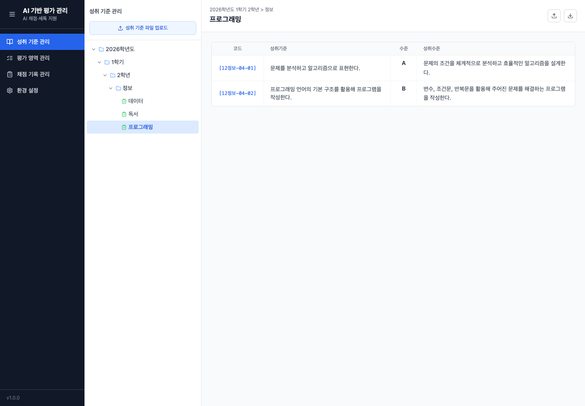
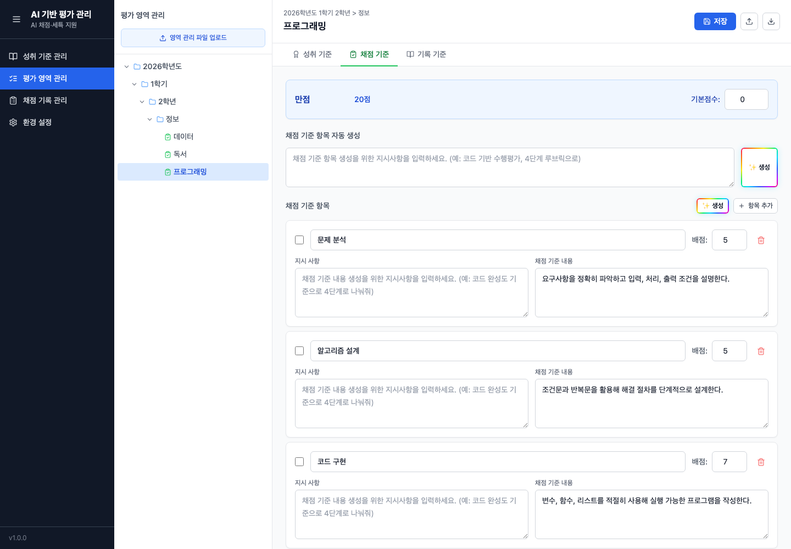

# AI 학생 평가 도우미

**나이스(NEIS)의 작업 형식을 유지하는 수행평가·채점·세특 작성 앱입니다.**  
나이스에서 내려받은 성취기준, 반영비율/만점관리, 수행평가 채점 파일, 과목세특 파일을 한곳에 모아 평가 기준 정리부터 학생별 기록 작성까지 이어서 작업할 수 있습니다.

## 주요 기능
 
- 나이스 기반 성취 기준 및 평가 영역 자동 관리
- 나이스 기반 수업별 학생 명단 자동 정리 및 학생별 채점, 활동 기록, 세특 동시 관리

## AI 기능

- 평가 영역 및 채점/세특 기준 생성
- 학생 산출물 기반 채점, 활동 기록, 세특 생성
- 세특 맞춤법/문장 교정
- AI 요청 시 학생 식별 정보 노출 최소화

## 작업 흐름

나이스에서 엑셀 파일을 내려 받아 앱에서 작업한 뒤, 다시 나이스 업로드용 엑셀 파일로 저장할 수 있습니다.

| 단계 | 나이스 엑셀 다운로드 | 앱에서 정리/작성 | 나이스 엑셀 업로드 |
| --- | --- | --- | --- |
| 기준 준비 | 성취기준/평가기준 | 성취 기준 확인, 평가 영역과 연결 |  |
|   | | ↓ |  |
| 영역 준비 | 반영비율/만점관리 | 수행평가 영역, 만점, 반영 여부 정리 |  |
|   | | ↓ |  |
| 채점 및 세특  | 수행평가 채점/과목 세특 파일 | 학생 명단 자동 관리, 학생별 점수 입력, AI 보조 채점, 교사 검토 | 채점 결과/세특 엑셀 파일 생성 (나이스 용) |


## 주요 화면

### 성취 기준 관리



### 평가 영역 관리



### 채점 기록 관리


## 다운로드 / 설치

- [Windows 다운로드 (.exe)](https://github.com/bloomgloom/ai-student-assessment-helper/releases/download/v0.1.0/AI.Student.Assessment.Helper.Setup.0.1.0.exe)
- [macOS 다운로드 (.dmg)](https://github.com/bloomgloom/ai-student-assessment-helper/releases/download/v0.1.0/AI.Student.Assessment.Helper-0.1.0-arm64.dmg)

macOS에서 “확인되지 않은 개발자” 경고가 나오면 Finder에서 앱을 우클릭한 뒤 `열기`를 선택합니다.

Windows에서 SmartScreen 경고가 나오면 배포자를 확인한 뒤 `추가 정보 > 실행`을 선택합니다.

## 개발자용

```bash
./scripts/build-mac.sh
```

```powershell
.\scripts\build-windows.ps1
```
